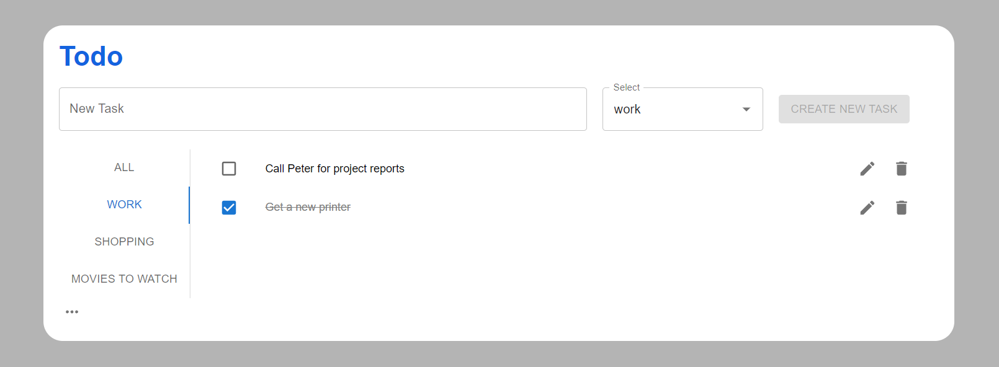

<h1 align='center'>TODO-APP</h1>

<a href='https://todo-app-website-pet-project.herokuapp.com/'>https://todo-app-website-pet-project.herokuapp.com//</a>

<h2>Technologies stack:</h2>
<ol>
    <li>
        <h3>Front-End:</h3>
        <ul>
            <li>JavaScript</li>
            <li>React</li>
            <li>Redux, Redux-Thunk</li>
            <li>Working with DB</li>
            <li>SCSS</li>
            <li>MUI</li>
        </ul>
    </li>
    <li>
        <h3>Code formatters:</h3>
        <ul>
            <li>ESLint</li>
            <li>Stylelint</li>
            <li>Prettier</li>
        </ul>
    </li>
    <li>
        <h3>DataBase:</h3>
        <ul>
            <li>Dexie.js</li>
        </ul>
    </li>
    <li>
        <h3>Deploying:</h3>
        <ul>
            <li>Heroku</li>
        </ul>
    </li>
</ol>
